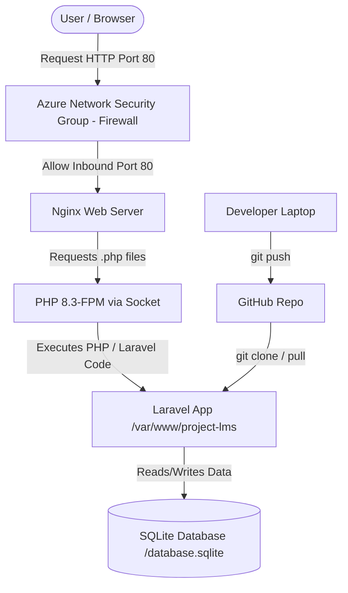

# Panduan Lengkap & Skema Deployment Laravel ke Azure Virtual Machine

Dokumen ini menjelaskan secara menyeluruh tentang arsitektur sistem, skema jaringan, hingga detail langkah-langkah deployment proyek Laravel LMS Anda ke Azure Virtual Machine (VM). Dokumentasi ini dirancang agar mudah dipahami sebagai bahan persiapan ujian/test Anda.

---

## 1. Skema & Arsitektur Deployment (Deployment Schema)

Sebelum masuk ke langkah-langkah teknis, penting untuk memahami bagaimana komponen-komponen ini saling terhubung di Azure VM:



### Penjelasan Komponen:
1. **Azure Virtual Machine (Ubuntu 24.04 LTS)**: Server virtual berbasis Linux tempat aplikasi Anda berjalan secara persisten.
2. **Azure Network Security Group (NSG)**: Firewall bawaan Azure yang menyaring lalu lintas data masuk (inbound) dan keluar (outbound). Kita membuka Port `80` (HTTP) dan Port `22` (SSH).
3. **Nginx Web Server**: Bertindak sebagai web server utama yang menerima HTTP request dari client/browser, menyajikan file statis (HTML/CSS/JS), dan meneruskan request file `.php` ke PHP-FPM.
4. **PHP 8.3-FPM (FastCGI Process Manager)**: Memproses kode PHP/Laravel di latar belakang. Nginx berkomunikasi dengan PHP-FPM menggunakan Unix Socket file (`unix:/var/run/php/php8.3-fpm.sock`).
5. **Laravel Framework**: Logika aplikasi LMS Anda. Entry point web-nya wajib diarahkan ke folder `/var/www/project-lms/public` (bukan folder root proyek).
6. **SQLite Database**: Engine database serverless berbasis file tunggal (`database.sqlite`). Sangat cocok untuk proyek skala kecil-menengah karena kinerjanya cepat dan tidak membutuhkan instalasi server database terpisah (seperti MySQL/PostgreSQL).

---

## 2. Langkah-Langkah Lengkap Dari Awal hingga Selesai

Berikut adalah urutan kronologis pengerjaan yang sudah kita lakukan:

### Tahap A: Pembuatan VM di Azure Portal
1. **Memilih OS Image**: Ubuntu Server 24.04 LTS (versi terbaru yang stabil dengan dukungan jangka panjang).
2. **Metode Autentikasi**: Menggunakan **Katasandi (Password)** alih-alih SSH Key untuk kemudahan akses:
   - **Username**: `kevin`
   - **Password**: `NexaLearnLMS2026!`
3. **Konfigurasi Firewall (Inbound Rules)**:
   - Azure secara otomatis membuka port `22` (SSH) agar kita bisa masuk ke terminal server.
   - Port `80` (HTTP) dan `443` (HTTPS) juga diaktifkan di pengaturan jaringan agar website bisa diakses dari browser umum.

---

### Tahap B: Pembersihan Git & Penyelamatan Privasi (Lokal Laptop)
*Kasus penting*: Terdapat kesalahan inisialisasi Git di mana folder `.git` berada di folder utama komputer (`C:\Users\Kevin Setiawan`), sehingga file pribadi di Desktop dan Downloads ikut terlacak.

1. **Menghapus Git salah tempat di lokal**:
   Menghapus folder `.git` tersembunyi di folder utama user komputer untuk menghentikan pelacakan file pribadi.
2. **Inisialisasi Git yang benar**:
   Masuk ke dalam direktori proyek khusus Laravel (`c:\Users\Kevin Setiawan\OneDrive\Desktop\MY PROJECT\project lms`) dan jalankan:
   ```bash
   git init
   ```
3. **Menghubungkan ke GitHub**:
   Mengarahkan remote repositori ke tempat yang benar:
   ```bash
   git remote add origin https://github.com/kevinnsetiawan/NexxaLMS-Web-Project.git
   ```
4. **Membuat Skrip Setup Otomatis**:
   Membuat file `setup-server.sh` di folder proyek lokal Anda untuk mengotomatiskan setup server Ubuntu nanti.
5. **Force-Push Bersih**:
   Menghapus seluruh riwayat salah upload di GitHub dengan memaksa push kode proyek LMS yang bersih:
   ```bash
   git add .
   git commit -m "Initial commit - Clean LMS Project"
   git branch -M main
   git push -f -u origin main
   ```

---

### Tahap C: Akses SSH & Kloning Kode (Di Dalam VM Azure)
1. **Membuka Azure Cloud Shell** (atau Terminal bawaan laptop) dan berpindah ke Bash:
   ```bash
   bash
   ```
2. **Konek ke VM melalui Protokol SSH**:
   ```bash
   ssh kevin@70.153.81.133
   ```
   *(Masuk menggunakan password `NexaLearnLMS2026!`)*.
3. **Membuat Direktori Web Server**:
   ```bash
   sudo mkdir -p /var/www
   cd /var/www
   ```
4. **Kloning Kode dari GitHub**:
   Menarik proyek LMS yang bersih dari GitHub langsung ke server:
   ```bash
   sudo git clone https://github.com/kevinnsetiawan/NexxaLMS-Web-Project.git project-lms
   ```

---

### Tahap D: Otomatisasi Instalasi Dependency & Nginx (via Skrip)
Kita masuk ke folder proyek di VM (`cd /var/www/project-lms`) dan menjalankan skrip setup:
```bash
sudo chmod +x setup-server.sh
sudo ./setup-server.sh
```

**Di balik layar, skrip `setup-server.sh` melakukan:**
1. **Mengupdate package manager** (`apt update`).
2. **Menginstal PHP 8.3** beserta semua extension yang dibutuhkan Laravel (seperti `sqlite3`, `curl`, `xml`, `mbstring`, `zip`, dll.).
3. **Menginstal Nginx** sebagai web server.
4. **Menginstal Composer** secara global untuk manajemen dependency PHP.
5. **Membuat Konfigurasi Nginx Server Block** (`/etc/nginx/sites-available/project-lms`) yang mengarahkan root direktori web server ke direktori Laravel publik `/var/www/project-lms/public`.
6. **Mengaktifkan konfigurasi baru** dan menonaktifkan konfigurasi default bawaan Nginx.
7. **Melakukan reload Nginx** agar konfigurasi baru aktif tanpa menghentikan server.

---

### Tahap E: Finalisasi Setup Laravel di VM
Setelah skrip selesai, kita melakukan konfigurasi internal Laravel secara manual di terminal VM:

1. **Menginstal dependencies PHP**:
   ```bash
   sudo composer install --no-dev --optimize-autoloader
   ```
2. **Membuat file konfigurasi `.env`**:
   ```bash
   sudo cp .env.example .env
   ```
3. **Membuat Application Key unik**:
   ```bash
   sudo php artisan key:generate
   ```
4. **Membuat file database SQLite baru**:
   ```bash
   sudo touch database/database.sqlite
   ```
5. **Menjalankan migrasi struktur tabel database & data awal (Seeder)**:
   ```bash
   sudo php artisan migrate --force
   sudo php artisan db:seed --force
   ```
6. **Mengatur Perizinan Folder (Permissions)**:
   Langkah krusial agar aplikasi Laravel dapat menulis file log, session, cache, dan menulis data ke database SQLite:
   ```bash
   sudo chown -R www-data:www-data /var/www/project-lms
   sudo chmod -R 775 /var/www/project-lms/storage
   sudo chmod -R 775 /var/www/project-lms/bootstrap/cache
   sudo chmod 775 /var/www/project-lms/database
   sudo chmod 664 /var/www/project-lms/database/database.sqlite
   ```

---

## 3. Cara Memverifikasi Hasil Deployment
1. Buka browser (Chrome, Edge, Firefox, dll.).
2. Akses IP Publik VM Anda menggunakan protokol HTTP:
   👉 **`http://70.153.81.133`**
3. Pastikan halaman beranda LMS tampil tanpa error `500` (Server Error) atau `403` (Forbidden).
4. Lakukan registrasi user baru untuk menguji apakah koneksi database SQLite berjalan dengan normal untuk aksi tulis (write) dan baca (read).

---

> [!TIP]
> **Materi Penting Untuk Ujian/Test:**
> - **Mengapa root Nginx harus diarahkan ke `/public` Laravel?**
>   Karena index.php (entry point utama aplikasi) berada di sana. Mengarahkan root ke folder proyek utama berbahaya secara keamanan karena file sensitif seperti `.env` bisa diakses publik.
> - **Mengapa izin folder (`chown` dan `chmod`) wajib diatur ke `www-data`?**
>   Di Ubuntu, Nginx dan PHP-FPM berjalan sebagai pengguna sistem bernama `www-data`. Jika folder `storage` atau file `database.sqlite` dimiliki oleh user biasa (`kevin`), PHP-FPM tidak akan memiliki izin menulis data (Error: *Permission Denied*).
